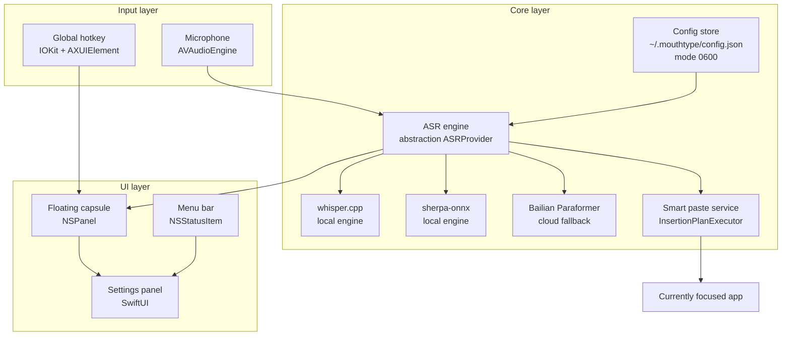

<div align="center">

# 🎙️ MouthType

 

**Native macOS dictation — local-first, Aliyun Bailian fallback, audio never leaves your Mac.**

`Hold ⌥ Space` → `speak` → `auto-paste into any app`

[](https://www.apple.com/macos/)
[](https://swift.org)
[](https://www.gnu.org/licenses/gpl-3.0.en.html)
[](Tests/)
[](#-roadmap)
[](SECURITY.md)

[中文](./README.md) · **[English](./README.en.md)**

[Quick start](#-quick-start) · [Features](#-features) · [Architecture](#-architecture) · [Comparison](#-comparison) · [Roadmap](#-roadmap)

</div>

---

> 📸 Screenshots auto-generated by GitHub Actions (GUI desktop capture is a planned v3.1 upgrade — `scripts/screenshot.js` + `.github/workflows/screenshot.yml`)

> A capsule appears while you hold the hotkey and disappears when you release it; local Whisper transcribes and auto-pastes back into the app you were using.

---

## ✨ Why MouthType

- **🎙️ Local Whisper first** — runs on your Mac via `whisper.cpp` / `sherpa-onnx`. Audio stays on-device by default.
- **🌐 Aliyun Bailian fallback** — for noisy environments or accent-specific accuracy, explicitly switch to the cloud; WebSocket reconnects automatically.
- **🎯 Floating capsule UI** — a translucent `NSPanel` appears at the cursor while held, vanishes on release, and never takes a permanent menu-bar slot.
- **📋 Robust paste service** — handles focus switches, clipboard races, and blocked inputs (Terminal, 1Password and password fields are politely bypassed).
- **🔐 Hard credential isolation** — the API key lives in `~/.mouthtype/config.json` with directory `0700` and file `0600`; the WebView never reads it directly.
- **🛡️ Automatic log redaction** — ID numbers, bank cards, phone numbers and URLs are masked before anything is written to logs.

---

## 🚀 Quick start

### 30 seconds — run from source

```bash
git clone https://github.com/davyzhong/MouthType
cd MouthType
swift build -c release
.build/release/MouthType
```

You should see a waveform icon in the menu bar. Then:

### 60 seconds — first dictation

1. Open MouthType (the menu-bar icon lights up).
2. Go to **Settings → Model** and pick an engine (`whisper-tiny` / `sherpa-onnx` / `bailian-paraformer`).
3. For the cloud fallback, put your Aliyun API key into `~/.mouthtype/config.json`:
   ```bash
   mkdir -p ~/.mouthtype && chmod 700 ~/.mouthtype
   $EDITOR ~/.mouthtype/config.json   # fields documented in docs/design-plan.md
   chmod 600 ~/.mouthtype/config.json
   ```
4. Hold the global hotkey (default **⌥ Space**).
5. Speak → release → the transcript is auto-pasted into the app you had focused.

> **Full tutorial**: [`docs/design-plan.md`](docs/design-plan.md)
> **Sample models**: place `ggml-*.bin` files into `Resources/whisper-models/`.

### System requirements

- **macOS 14.0 (Sonoma)** or later (Apple Silicon recommended; Intel supported).
- **Xcode 15+ / Swift 6.0+** (only needed when building from source).
- On first launch you'll be guided through microphone, accessibility and input-monitoring permissions.

---

## 📸 What it looks like

> ⚠️ Screenshot slots are `[TODO]` placeholders; they will be replaced automatically once real captures land in `.github/screenshots/`.

### Floating capsule + menu bar

<p align="center">
  <a href=".github/screenshots/capsule.png"></a>
  <a href=".github/screenshots/menubar.png"></a>
</p>
<p align="center"><sub><em>[TODO: capsule.png] · [TODO: menubar.png]</em></sub></p>

### Settings panel + permission onboarding

<p align="center">
  <a href=".github/screenshots/settings.png"></a>
  <a href=".github/screenshots/permissions.png"></a>
</p>
<p align="center"><sub><em>[TODO: settings.png] · [TODO: permissions.png]</em></sub></p>

---

## 🏗️ Architecture



**Main path**: microphone → VAD → selected ASR engine → smart paste into the focused app.

| Color | Meaning |
|---|---|
| 🟦 Input layer | audio capture, global hotkey |
| 🟨 Core layer | ASR engines, paste service, credentials |
| 🟩 UI layer | floating capsule, menu bar, settings |

---

## 📦 Features

### 🎯 Core capabilities

- 🎤 **Local Whisper transcription** — multiple model tiers (tiny / base / small), fully offline.
- 🧠 **sherpa-onnx engine** — alternative local engine, better suited to low-memory Macs.
- 🌐 **Bailian Paraformer fallback** — WebSocket with auto-reconnect, for noisy environments.
- 🎯 **Floating capsule UI** — an `NSPanel` that appears on press and vanishes on release, draggable.
- 📋 **Smart paste** — handles lost focus, Terminal password prompts, 1Password, and more.
- 🔐 **Least-privilege credentials** — file `0600`, directory `0700`, WebView never touches plaintext.
- ⌨️ **Configurable hotkey** — single-modifier combos with `⌥` / `⌘` / `⌃` / `⇧`.

### 🛡️ Quality & security

- 🧪 **149 tests across 19 files** — unit and UI test layers.
- 🧹 **Documented thread safety** — every `@unchecked Sendable` carries a rationale.
- 🔍 **Full code review** — see [`docs/project-review-report.md`](docs/project-review-report.md).
- 🛡️ **Log redaction** — ID numbers, bank cards, phone numbers and URLs masked automatically.
- ⚡ **Performance baselines** — audio preprocessing 100 ms buffer ≈ 0.3 ms; short-text log redaction ≈ 0.4 ms.
- 🧰 **Unified build script** — `./scripts/build.sh` covers debug / release / signing.

### 🖥️ Platform support

| Platform | Version | Status | Notes |
|---|---|---|---|
| macOS Apple Silicon | 14.0+ | ✅ Recommended | Universal binary |
| macOS Intel | 14.0+ | ✅ Supported | x86_64 build |
| macOS 13 (Ventura) and below | — | ❌ Unsupported | required APIs are version-gated |

---

## 🆚 Comparison

| Dimension | MouthType | Typeless | MacWhisper | Wispr Flow |
|---|---|---|---|---|
| Local ASR | ✅ whisper.cpp + sherpa-onnx | ❌ cloud | ✅ whisper.cpp | ❌ cloud |
| CN cloud fallback | ✅ Bailian | ❌ | ❌ | ❌ |
| Floating capsule UI | ✅ NSPanel | ✅ | ⚠️ menu bar only | ✅ |
| macOS 13 support | ❌ | ✅ | ✅ | ✅ |
| Open source | ✅ GPL-3.0 | ❌ | ✅ | ❌ |
| Exposed settings | everything | minimal | moderate | minimal |
| Chinese recognition | ✅ excellent | ⚠️ fair | ✅ good | ✅ excellent |
| API key isolation | ✅ file 0600 | n/a | ⚠️ | n/a |

---

## 🗓️ Roadmap

- [x] **v1.0** — local Whisper + floating capsule + smart paste
- [x] **v1.1** — CN cloud fallback (Bailian Paraformer)
- [x] **v1.2** — full code review + dead-code cleanup + performance pass
- [x] **v1.3** — credential permission isolation + log redaction
- [x] **v1.4** — 19 test files / 149 cases (unit + UI)
- [ ] **v2.0** — parallel multi-engine routing + automatic best-result selection
- [ ] **v2.1** — streaming preview (results while you speak)
- [ ] **v2.2** — free hotkey composition (single + chained modifiers)
- [ ] **v2.3** — Homebrew cask distribution

> Design in [`docs/design-plan.md`](docs/design-plan.md); progress in [`docs/current-status.md`](docs/current-status.md); E2E acceptance in [`docs/e2e-checklist.md`](docs/e2e-checklist.md).

---

## 🛠️ Tech stack

- **UI**: SwiftUI + AppKit (`NSPanel` / `NSStatusItem`)
- **Audio**: `AVAudioEngine` + `AudioRingBuffer` (light-lock producer/consumer)
- **Local ASR**: `whisper.cpp` (SwiftPM bindings), `sherpa-onnx`
- **Cloud ASR**: Aliyun Bailian Paraformer over WebSocket with auto-reconnect
- **Storage**: `SQLite.swift` for transcription history and dictionaries
- **Permissions**: IOKit (hotkeys), AXUIElement (focus-aware paste)
- **Testing**: XCTest (unit + UI) + performance baselines + coverage reports

---

## 📚 Documentation map

| Category | Doc |
|---|---|
| Design | [`docs/design-plan.md`](docs/design-plan.md) |
| Current status | [`docs/current-status.md`](docs/current-status.md) |
| E2E acceptance | [`docs/e2e-checklist.md`](docs/e2e-checklist.md) |
| E2E execution report | [`docs/e2e-checklist-execution-report.md`](docs/e2e-checklist-execution-report.md) |
| Code review | [`docs/project-review-report.md`](docs/project-review-report.md) |
| Developer guide | [`DEVELOPER.md`](DEVELOPER.md) |
| Changelog | [`CHANGELOG.md`](CHANGELOG.md) |

---

## 🤝 Contributing & code of conduct

PRs welcome! Start with [`DEVELOPER.md`](DEVELOPER.md). High-leverage directions:

- **New ASR engines** — the seam is `Services/ASRProvider`.
- **Localization** — sources in `Resources/Localizable.strings` (currently `en` + `zh-Hans`).
- **Performance profiling** — Instruments time-profiler flame graphs.
- **macOS 13 support** — unlocks older hardware, see v2.3.

This project follows the spirit of the [Contributor Covenant v2.1](https://www.contributor-covenant.org/version/2/1/code_of_conduct/).

---

## 🔒 Security

Report vulnerabilities privately — **do not open a public GitHub issue**. See [`SECURITY.md`](SECURITY.md) for the supported-version table, disclosure window and, if needed, a PGP fingerprint.

MouthType's threat model and mitigations:

- **Local-audio policy** — `whisper.cpp` / `sherpa-onnx` are fully local; the cloud path is an explicit opt-in second route.
- **Credential permission isolation** — `~/.mouthtype/config.json` is forced to `0600` on creation, directory `0700`, never read by the WebView.
- **Renderer isolation** — inputs return via IPC only; key strings are stripped before re-render.
- **Log redaction** — PII, financial and contact patterns masked before write; see `Services/LogRedaction.swift`.

---

## 📜 License

[GPL-3.0](https://www.gnu.org/licenses/gpl-3.0.en.html) — free to use, modify and redistribute. If you publish derivative works, keep compatible open-source terms.

---

<div align="center">

<sub>📌 MouthType is maintained with ❤️ by <a href="https://github.com/davyzhong">qiming</a> · <a href="https://github.com/davyzhong/MouthType/issues">🐛 Report a bug</a> · <a href="https://github.com/davyzhong/MouthType/discussions">💬 Discussions</a></sub>

</div>
