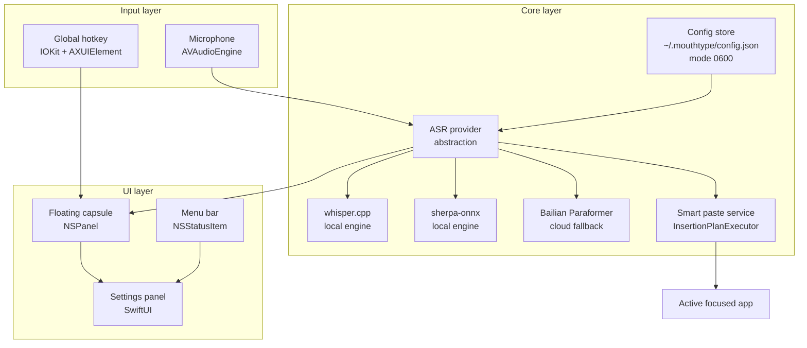

> ⚠️ 本翻译最后更新于 2026-09-21，主 README 于 2026-09-23 有多项修复未同步至此；最新内容以 [主文档](./README.md) 为准。

---
name: MouthType
description: Native macOS voice dictation that keeps your audio on your Mac — local Whisper by default, Aliyun Bailian as a fallback when you need it.
license: GPL-3.0
homepage: https://github.com/davyzhong/MouthType
platforms:
  - macOS 14.0+ (Apple Silicon / Intel)
language: Swift 6
model: gpt-4 / claude-sonnet / gemini-2.5
intent: code-generation / question-answering / agent-tool
capabilities:
  - install
  - quickstart
  - build
  - troubleshoot
tags:
  - macos
  - swift
  - swiftui
  - dictation
  - speech-to-text
  - whisper-cpp
  - sherpa-onnx
  - asr
  - privacy-first
  - menu-bar
  - floating-capsule
---

<div align="center">

# 🎙️ MouthType

**Native macOS dictation that respects your voice — local-first, Aliyun Bailian as a fallback.**

`Hold ⌥ Space` → `Speak` → `Auto-paste into any app`

[](https://www.apple.com/macos/)
[](https://swift.org)
[](LICENSE)
[](Tests/)
[](#-roadmap)
[](SECURITY.md)

**Languages**: [English](./README.md) · [中文](./README.zh.md)

[Quick Start](#-quick-start) · [Features](#-features) · [Architecture](#-architecture) · [Comparison](#-comparison) · [Roadmap](#-roadmap)

</div>

---

> A floating capsule shows up while you hold the hotkey, your voice is transcribed locally, and the text lands in whatever app you were just typing in.

---

## ✨ Why MouthType

- **🎙️ Local Whisper by default** — runs on your Mac via `whisper.cpp` / `sherpa-onnx`. Your audio never leaves the machine unless you ask it to.
- **🌐 Aliyun Bailian fallback** — when you explicitly want cloud accuracy for noisy rooms or regional accents, the optional WebSocket provider reconnects automatically.
- **🎯 Floating capsule UI** — a translucent `NSPanel` appears under the cursor, vanishes the moment you release. No permanent bar of widgets stealing your screen.
- **📋 Robust paste service** — handles focus changes, clipboard races, and apps that block synthetic input (Terminal, 1Password, password fields are politely bypassed).
- **🔐 Locked-down secrets** — API keys live in `~/.mouthtype/config.json` with directory mode `0700` and file mode `0600`. Never read by the WebView.
- **🛡️ Auto-redacted logs** — national IDs, card numbers, phone numbers, and URLs are masked before they touch disk.

---

## 🚀 Quick Start

### 30 seconds — try it (from source)

```bash
git clone https://github.com/davyzhong/MouthType
cd MouthType
swift build -c release
.build/release/MouthType
```

You should see a waveform-like icon appear in the menu bar. From there:

### 60 seconds — first dictation

1. Open MouthType (menu bar icon visible).
2. In **Settings → Model**, pick an engine — `whisper-tiny`, `sherpa-onnx`, or `bailian-paraformer`.
3. If you want cloud fallback, drop your Aliyun API key into `~/.mouthtype/config.json`:
   ```bash
   mkdir -p ~/.mouthtype && chmod 700 ~/.mouthtype
   $EDITOR ~/.mouthtype/config.json   # see docs/design-plan.md for schema
   chmod 600 ~/.mouthtype/config.json
   ```
4. Press and hold the global hotkey (default **⌥ Space**).
5. Speak → release → the transcript lands in your previously focused app.

> **Detailed walk-through**: [`docs/design-plan.md`](docs/design-plan.md)
> **Sample models**: drop `ggml-*.bin` files into `Resources/whisper-models/`.

### System requirements

- **macOS 14.0 (Sonoma)** or later, on Apple Silicon (recommended) or Intel.
- **Xcode 15+ / Swift 6.0+** (only required if you build from source).
- Microphone, Accessibility, and Input Monitoring permissions will be requested on first launch.

---

## 📸 Visual Tour

> ⚠️ Screenshots are queued as `[TODO]` placeholders. Until then, every section below the fold shows what the screen looks like in words. Run the app and drop real PNGs into `.github/screenshots/` to upgrade.

### Floating capsule + menu bar

<p align="center">
  <a href=".github/screenshots/capsule.png"></a>
  <a href=".github/screenshots/menubar.png"></a>
</p>
<p align="center"><sub><em>[TODO: capsule.png] · [TODO: menubar.png]</em></sub></p>

### Settings panel + permission flow

<p align="center">
  <a href=".github/screenshots/settings.png"></a>
  <a href=".github/screenshots/permissions.png"></a>
</p>
<p align="center"><sub><em>[TODO: settings.png] · [TODO: permissions.png]</em></sub></p>

> Drop real screenshots into `.github/screenshots/` and the placeholders will resolve automatically.

---

## 🏗️ Architecture



**Hot path**: microphone → VAD → chosen ASR provider → paste into the previously focused app.

| Color guide | Meaning |
|---|---|
| 🟦 Input layer | Audio capture, hotkey registration |
| 🟨 Core layer | ASR engines, paste service, secrets |
| 🟩 UI layer | Capsule, menu bar, settings |

---

## 📦 Features

### 🎯 Core capabilities

- 🎤 **Local Whisper transcription** — multiple model sizes (tiny / base / small) running fully offline.
- 🧠 **sherpa-onnx engine** — alternative local engine, optimized for low-memory Macs.
- 🌐 **Bailian Paraformer cloud fallback** — WebSocket with automatic reconnect for noisy environments.
- 🎯 **Floating capsule UI** — press-and-hold `NSPanel`, releases on key-up. Drag to reposition.
- 📋 **Smart paste** — plans around focus loss, Terminal password fields, and 1Password vaults.
- 🔐 **Least-privilege secrets** — directory mode `0700`, file mode `0600`, never exposed to the WebView.
- ⌨️ **Configurable hotkeys** — `⌥`, `⌘`, `⌃`, `⇧` single-modifier combinations all supported.

### 🛡️ Quality & safety

- 🧪 **149 test cases across 19 files** — unit + UI test dual coverage.
- 🧹 **Thread-safety documented** — every `@unchecked Sendable` class has an inline rationale.
- 🔍 **Full project review** — see [`docs/project-review-report.md`](docs/project-review-report.md).
- 🛡️ **Log redaction** — national IDs, card numbers, phone numbers, URLs auto-masked before write.
- ⚡ **Performance benchmarks** — audio preprocessor ≈ 0.3 ms per 100 ms buffer; log redaction ≈ 0.4 ms per short text.
- 🧰 **Unified build script** — `./scripts/build.sh` for debug / release / signed builds.

### 🖥️ Platform support

| Platform | Version | Status | Notes |
|---|---|---|---|
| macOS Apple Silicon | 14.0+ | ✅ recommended | Universal binary path |
| macOS Intel | 14.0+ | ✅ supported | x86_64 build |
| macOS 13 (Ventura) and earlier | — | ❌ not supported | Apple restricted required APIs |

---

## 🆚 Comparison

| Dimension | MouthType | Typeless | MacWhisper | Wispr Flow |
|---|---|---|---|---|
| Local ASR | ✅ whisper.cpp + sherpa-onnx | ❌ cloud only | ✅ whisper.cpp | ❌ cloud only |
| China-region cloud fallback | ✅ Bailian Paraformer | ❌ | ❌ | ❌ |
| Floating capsule UI | ✅ NSPanel | ✅ | ⚠️ menu-bar only | ✅ |
| macOS 13 support | ❌ | ✅ | ✅ | ✅ |
| Open source | ✅ GPL-3.0 | ❌ | ✅ | ❌ |
| Configuration surface | fully open | minimal | medium | minimal |
| Mandarin accuracy | ✅ strong | ⚠️ average | ✅ good | ✅ strong |
| API key isolation | ✅ file mode 0600 | n/a | ⚠️ | n/a |

---

## 🗓️ Roadmap

- [x] **v1.0** — Local Whisper + floating capsule + smart paste
- [x] **v1.1** — China-region cloud fallback (Bailian Paraformer)
- [x] **v1.2** — Code review + dead-code sweep + performance pass
- [x] **v1.3** — Permission-isolated secrets + log redaction
- [x] **v1.4** — 149 tests across 19 files (unit + UI)
- [ ] **v2.0** — Multi-engine parallel routing + best-result selection
- [ ] **v2.1** — Streaming preview while speaking
- [ ] **v2.2** — Free-form hotkey composer (single + chained modifiers)
- [ ] **v2.3** — Homebrew cask distribution

> Design notes live in [`docs/design-plan.md`](docs/design-plan.md); current sprint status in [`docs/current-status.md`](docs/current-status.md); test gates in [`docs/e2e-checklist.md`](docs/e2e-checklist.md).

---

## 🛠️ Tech stack

- **UI**: SwiftUI + AppKit (`NSPanel`, `NSStatusItem`)
- **Audio**: `AVAudioEngine` with `AudioRingBuffer` (lock-light producer/consumer)
- **Local ASR**: `whisper.cpp` (bindings via SwiftPM), `sherpa-onnx`
- **Cloud ASR**: Aliyun Bailian Paraformer over WebSocket with auto-reconnect
- **Storage**: `SQLite.swift` for transcript history and dictionary
- **Privileges**: IOKit (hotkey), AXUIElement (focus-aware pasting)
- **Testing**: XCTest (unit + UI), performance benchmarks, coverage report

---

## 📚 Documentation

| Category | Document |
|---|---|
| Design proposal | [`docs/design-plan.md`](docs/design-plan.md) |
| Sprint status | [`docs/current-status.md`](docs/current-status.md) |
| E2E acceptance | [`docs/e2e-checklist.md`](docs/e2e-checklist.md) |
| E2E run report | [`docs/e2e-checklist-execution-report.md`](docs/e2e-checklist-execution-report.md) |
| Code review | [`docs/project-review-report.md`](docs/project-review-report.md) |
| Developer guide | [`DEVELOPER.md`](DEVELOPER.md) |
| Changelog | [`CHANGELOG.md`](CHANGELOG.md) |
| Translator notes | [`CLAUDE.md`](CLAUDE.md) |

---

## 🤝 Contributing & Code of Conduct

Pull requests are welcome — start with [`DEVELOPER.md`](DEVELOPER.md). High-leverage contributions:

- **New ASR engine integration** — see `Services/ASRProvider` for the seam.
- **Localization** — `Resources/Localizable.strings` is the source of truth (currently `en` and `zh-Hans`).
- **Performance profiling** — Instruments Time Profiler flame graphs.
- **macOS 13 support** — would unblock older hardware; see the v2.3 ticket.

This project follows the spirit of the [Contributor Covenant v2.1](https://www.contributor-covenant.org/version/2/1/code_of_conduct/).

---

## 🔒 Security

Found a vulnerability? Please disclose privately — **do not file a public GitHub issue.** See [`SECURITY.md`](SECURITY.md) for the supported-versions table, the disclosure window, and the PGP fingerprint (if applicable).

MouthType's threat model and mitigations:

- **Local audio by design** — whisper.cpp / sherpa-onnx run entirely on-device; cloud providers are an opt-in second path.
- **Privileged secrets** — `~/.mouthtype/config.json` is created with mode `0600`; the directory with `0700`. The WebView never sees raw key material.
- **Reactive UI isolation** — input fields post back via IPC, key strings are stripped before re-render.
- **Log redaction** — PII, financial, and contact patterns are masked before write. See `Services/LogRedaction.swift`.

---

## 📜 License

[GPL-3.0](LICENSE) — free to use, modify, and redistribute. If you ship a derived work, please keep it open under compatible terms.

---

<div align="center">

<sub>📌 MouthType is maintained by <a href="https://github.com/davyzhong">qiming</a> · <a href="https://github.com/davyzhong/MouthType/issues">🐛 Report a bug</a> · <a href="https://github.com/davyzhong/MouthType/discussions">💬 Discuss</a></sub>

</div>
