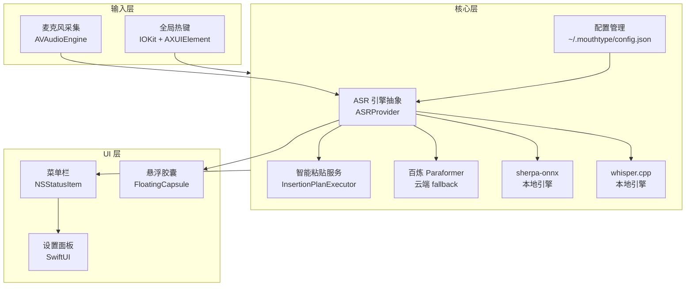

<div align="center">

# 🎙️ MouthType

**macOS 原生语音听写应用 · 悬浮即用 · 本地优先 · 国内云端 fallback**

`按住 ⌥ Space` → `说话` → `自动粘贴到任意应用`

[](https://www.apple.com/macos/)
[](https://swift.org)
[](LICENSE)
[](Tests/)
[](#-roadmap)

[快速开始](#-快速开始) · [功能](#-功能) · [架构](#-架构) · [同类对比](#-同类对比) · [Roadmap](#-roadmap) · [文档](#-文档导航)

</div>

---

> **MouthType** 是给不想把语音数据上送国外云、又想要 macOS 原生体验的人做的听写工具。
> 默认走本地 Whisper（whisper.cpp / sherpa-onnx），云端 fallback 走阿里云百炼 Paraformer，UI 用 NSPanel 实现的悬浮胶囊，按下出现、松开消失。

---

## ✨ 核心亮点

| | 特性 | 说明 |
|---|---|---|
| 🎙️ | **本地 Whisper 优先** | 默认 whisper.cpp / sherpa-onnx 离线识别，语音数据不出本机 |
| 🌐 | **国内云端 fallback** | 阿里云百炼 Paraformer，WebSocket 自动重连，断网弱网也能用 |
| 🎯 | **悬浮胶囊 UI** | NSPanel 浮动指示器，按下出现/松开消失，不抢主屏 |
| 📋 | **智能粘贴服务** | 跨应用粘贴兼容性方案，处理 focus 切换、剪贴板竞态 |
| 🔐 | **API key 权限隔离** | `~/.mouthtype/config.json`，目录 `0700` 文件 `0600`，最小权限原则 |
| 🛡️ | **日志自动脱敏** | 身份证、银行卡、手机号、URL 等敏感字段自动脱敏 |
| 🧪 | **19 个测试文件** | 单元测试 + UI 测试双层覆盖，含音频管道、权限、粘贴、错误恢复 |

---

## 🚀 快速开始

### 系统要求

- macOS 14.0 或更高版本（Apple Silicon / Intel）
- Xcode 15+ / Swift 6.0+
- 麦克风权限、辅助功能权限、输入监控权限

### 从源码构建

```bash
git clone https://github.com/davyzhong/MouthType
cd MouthType
swift build -c release
.build/release/MouthType
```

### 配置（首次启动后）

```text
1. 打开 MouthType（菜单栏图标出现）
2. 在「设置 → 模型」里选择引擎（whisper-tiny / sherpa-onnx / 百炼 Paraformer）
3. 如需云端 fallback，在 ~/.mouthtype/config.json 配置 API key
4. 触发热键（默认 ⌥ Space）
5. 说话 → 松开 → 转录自动粘贴
```

> **详细教程**：[`docs/design-plan.md`](docs/design-plan.md)

---

## 📸 它跑起来长什么样

> ⚠️ 截图占位 — 实际截图待补。你可以本地启动 MouthType 后用 `⌘⇧4` 截图后放到 `.github/screenshots/`。

### 主界面：悬浮胶囊 + 菜单栏

<p align="center">
  <a href=".github/screenshots/capsule.png"></a>
  <a href=".github/screenshots/menubar.png"></a>
</p>

### 设置面板：模型选择 + 热键配置

<p align="center">
  <a href=".github/screenshots/settings.png"></a>
  <a href=".github/screenshots/permissions.png"></a>
</p>

### 终端预览

> 真实命令输出可在本地构建后跑 `.build/release/MouthType --help` 获取。

---

## 🏗️ 架构



**主链路**：麦克风 → ASR 引擎 → 智能粘贴 → 当前应用

---

## 📦 功能

### 🎯 核心能力

- 🎤 **本地 Whisper 转录** - 多档模型可选（tiny / base / small），离线运行
- 🌐 **云端 fallback** - 阿里云百炼 Paraformer（国内可用，断网重连）
- 🎯 **悬浮胶囊 UI** - NSPanel 浮动指示器，按下出现/松开消失
- 📋 **智能粘贴** - 跨应用粘贴兼容，处理 focus 切换和剪贴板竞态
- 🔐 **权限最小化** - 目录 `0700`、文件 `0600`、API key 本地隔离
- ⚙️ **可配置热键** - 全局热键，支持 ⌥/⌘/⌃/⇧ 单修饰键组合

### 🧪 质量保证

- 🧪 **19 个测试文件** - 单元测试 + UI 测试双层覆盖
- 🛡️ **线程安全文档** - `@unchecked Sendable` 类均添加说明
- 🔍 **全面代码审查** - 见 [`docs/project-review-report.md`](docs/project-review-report.md)
- 📝 **日志脱敏** - 身份证、银行卡、手机号、URL 自动脱敏
- ⚡ **性能优化** - AudioRingBuffer 减锁竞争、VADProcessor 去重计算

### 🖥️ 平台支持

| 平台 | 版本 | 状态 |
|---|---|---|
| macOS Apple Silicon | 14.0+ | ✅ 推荐 |
| macOS Intel | 14.0+ | ✅ 支持 |
| macOS 13 及以下 | - | ❌ 不支持 |

---

## 🆚 同类对比

| 维度 | MouthType | Typeless | MacWhisper | Wispr Flow |
|---|---|---|---|---|
| 本地 ASR | ✅ whisper.cpp | ❌ 云端 | ✅ whisper.cpp | ❌ 云端 |
| 国内云 fallback | ✅ 百炼 | ❌ | ❌ | ❌ |
| 悬浮胶囊 UI | ✅ NSPanel | ✅ | ⚠️ 菜单栏 | ✅ |
| macOS 13 支持 | ❌ | ✅ | ✅ | ✅ |
| 开源 | ✅ GPL-3.0 | ❌ | ✅ | ❌ |
| 配置项暴露 | 全开放 | 极少 | 中等 | 极少 |
| 中文识别 | ✅ 优秀 | ⚠️ 一般 | ✅ 良好 | ✅ 优秀 |

---

## 🗓️ Roadmap

- [x] v1.0 本地 Whisper + 悬浮胶囊 + 智能粘贴
- [x] v1.1 国内云 fallback（百炼 Paraformer）
- [x] v1.2 全面代码审查 + 死代码清理 + 性能优化
- [x] v1.3 权限隔离存储 + 日志脱敏
- [x] v1.4 19 个测试文件 + 单元测试 + UI 测试
- [ ] v2.0 多引擎并行 + 自动选最佳结果
- [ ] v2.1 流式预览（边说边显示识别结果）
- [ ] v2.2 自定义热键组合（已支持部分，全开放）
- [ ] v2.3 Homebrew cask 分发

> 详细设计见 [`docs/design-plan.md`](docs/design-plan.md)；执行进度见 [`docs/current-status.md`](docs/current-status.md)。

---

## 📊 数据看板

| 指标 | 数值 | 指标 | 数值 |
|---|---|---|---|
| 🧪 测试文件 | **19 个** | 📁 源码模块 | **20+ 个** |
| 🏗️ Swift 平台 | **macOS 14+** | 🔐 权限策略 | **目录 0700 / 文件 0600** |
| 🌐 ASR 引擎 | **3 个** | 📦 依赖 | **SQLite.swift** |

---

## 🛠️ 技术栈

- **UI**：SwiftUI + AppKit（NSPanel, NSStatusItem）
- **音频**：AVAudioEngine（音频采集与环形缓冲）
- **本地 ASR**：whisper.cpp / sherpa-onnx
- **云端 ASR**：阿里云百炼 Paraformer（WebSocket + 自动重连）
- **存储**：SQLite.swift
- **权限**：IOKit（热键）+ AXUIElement（上下文感知）
- **测试**：XCTest（单元 + UI）

---

## 📚 文档导航

| 类别 | 文档 |
|---|---|
| 设计方案 | [`docs/design-plan.md`](docs/design-plan.md) |
| 当前状态 | [`docs/current-status.md`](docs/current-status.md) |
| E2E 验收 | [`docs/e2e-checklist.md`](docs/e2e-checklist.md) |
| E2E 执行报告 | [`docs/e2e-checklist-execution-report.md`](docs/e2e-checklist-execution-report.md) |
| 代码审查 | [`docs/project-review-report.md`](docs/project-review-report.md) |
| 开发者指南 | [`DEVELOPER.md`](DEVELOPER.md) |
| 变更日志 | [`CHANGELOG.md`](CHANGELOG.md) |

---

## 🤝 贡献

欢迎 PR！详见 [`DEVELOPER.md`](DEVELOPER.md) 与 [`docs/project-review-report.md`](docs/project-review-report.md)。

主要贡献方向：
- 新 ASR 引擎接入
- 国际化翻译（目前中文 + 英文）
- 性能 profiling（Instruments 火焰图）
- macOS 13 适配

---

## 📜 License

[GPL-3.0](LICENSE) — 自由使用，欢迎二次开发并开源回馈。

---

<div align="center">

<sub>📌 MouthType 由 <a href="https://github.com/davyzhong">qiming</a> 用 ❤️ 维护 · <a href="https://github.com/davyzhong/MouthType/issues">🐛 报告 Bug</a> · <a href="https://github.com/davyzhong/MouthType/discussions">💬 讨论</a></sub>

</div>