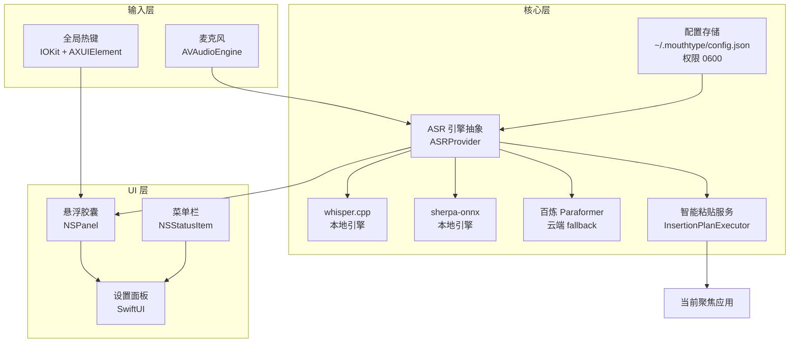

<div align="center">

# 🎙️ MouthType

**原生 macOS 听写工具 — 本地优先，阿里云百炼 fallback，语音数据不出本机。**

`按住 ⌥ Space` → `说话` → `自动粘贴到任意应用`

[](https://www.apple.com/macos/)
[](https://swift.org)
[](LICENSE)
[](Tests/)
[](#-roadmap)
[](SECURITY.md)

**Languages**: [English](./README.md) · [中文](./README.zh.md)

[快速开始](#-快速开始) · [功能](#-功能) · [架构](#-架构) · [同类对比](#-同类对比) · [Roadmap](#-roadmap)

</div>

---

> 按住热键时浮现胶囊，松手即消失；本地 Whisper 转写后自动粘贴回你刚才在用的应用。

---

## ✨ 为什么选 MouthType

- **🎙️ 本地 Whisper 优先** — 通过 `whisper.cpp` / `sherpa-onnx` 在你的 Mac 上跑。语音默认不出本机。
- **🌐 阿里云百炼 fallback** — 当环境嘈杂或需要特定口音精度时，可显式切换到云端，WebSocket 自动重连。
- **🎯 悬浮胶囊 UI** — 半透明 `NSPanel` 跟随光标出现，松手即收。不占菜单栏永久位置。
- **📋 鲁棒的粘贴服务** — 妥善处理焦点切换、剪贴板竞态、被屏蔽的输入框（Terminal、1Password、密码字段会被礼貌绕过）。
- **🔐 凭据硬隔离** — API key 存放在 `~/.mouthtype/config.json`，目录 `0700`、文件 `0600`，WebView 永不直接读取。
- **🛡️ 日志自动脱敏** — 身份证、银行卡、手机号、URL 在写入日志前就已脱敏。

---

## 🚀 快速开始

### 30 秒试用 — 从源码启动

```bash
git clone https://github.com/davyzhong/MouthType
cd MouthType
swift build -c release
.build/release/MouthType
```

你应该能在菜单栏看到一个波形图标。然后：

### 60 秒 — 完成首次听写

1. 打开 MouthType（菜单栏图标亮起）。
2. 进入 **设置 → 模型**，挑选引擎（`whisper-tiny` / `sherpa-onnx` / `bailian-paraformer`）。
3. 如需云端 fallback，把阿里云 API key 写入 `~/.mouthtype/config.json`：
   ```bash
   mkdir -p ~/.mouthtype && chmod 700 ~/.mouthtype
   $EDITOR ~/.mouthtype/config.json   # 字段见 docs/design-plan.md
   chmod 600 ~/.mouthtype/config.json
   ```
4. 按住全局热键（默认 **⌥ Space**）。
5. 说话 → 松开 → 转录结果自动粘贴回你刚才聚焦的应用。

> **详细教程**：[`docs/design-plan.md`](docs/design-plan.md)
> **示例模型**：把 `ggml-*.bin` 文件放进 `Resources/whisper-models/`。

### 系统要求

- **macOS 14.0 (Sonoma)** 或更高版本（推荐 Apple Silicon，也支持 Intel）。
- **Xcode 15+ / Swift 6.0+**（仅在从源码构建时需要）。
- 首次启动时会引导授予麦克风、辅助功能、输入监控权限。

---

## 📸 它跑起来长什么样

> ⚠️ 截图位置用 `[TODO]` 占位，等真实截图归档到 `.github/screenshots/` 后会自动替换。

### 悬浮胶囊 + 菜单栏

<p align="center">
  <a href=".github/screenshots/capsule.png"></a>
  <a href=".github/screenshots/menubar.png"></a>
</p>
<p align="center"><sub><em>[TODO: capsule.png] · [TODO: menubar.png]</em></sub></p>

### 设置面板 + 权限引导

<p align="center">
  <a href=".github/screenshots/settings.png"></a>
  <a href=".github/screenshots/permissions.png"></a>
</p>
<p align="center"><sub><em>[TODO: settings.png] · [TODO: permissions.png]</em></sub></p>

---

## 🏗️ 架构



**主路径**：麦克风 → VAD → 选定 ASR 引擎 → 智能粘贴到聚焦应用。

| 配色 | 含义 |
|---|---|
| 🟦 输入层 | 音频采集、全局热键 |
| 🟨 核心层 | ASR 引擎、粘贴服务、凭据 |
| 🟩 UI 层 | 悬浮胶囊、菜单栏、设置 |

---

## 📦 功能

### 🎯 核心能力

- 🎤 **本地 Whisper 转写** — 多档模型（tiny / base / small），全程离线。
- 🧠 **sherpa-onnx 引擎** — 备用本地引擎，更适合低内存 Mac。
- 🌐 **百炼 Paraformer fallback** — WebSocket + 自动重连，适合嘈杂环境。
- 🎯 **悬浮胶囊 UI** — 按下出现的 `NSPanel`，松开消失，可拖拽。
- 📋 **智能粘贴** — 处理焦点丢失、Terminal 密码段、1Password 等。
- 🔐 **凭据最小权限** — 文件 `0600`、目录 `0700`，WebView 永不接触明文。
- ⌨️ **可配置热键** — 支持 `⌥` / `⌘` / `⌃` / `⇧` 单修饰键组合。

### 🛡️ 质量与安全

- 🧪 **149 个测试，19 个文件** — 单元测试 + UI 测试双层覆盖。
- 🧹 **线程安全文档化** — 每个 `@unchecked Sendable` 都附说明。
- 🔍 **完整代码审查** — 见 [`docs/project-review-report.md`](docs/project-review-report.md)。
- 🛡️ **日志脱敏** — 身份证、银行卡、手机号、URL 自动 mask。
- ⚡ **性能基准** — 音频预处理 100ms 缓冲 ≈ 0.3 ms；日志脱敏短文本 ≈ 0.4 ms。
- 🧰 **统一构建脚本** — `./scripts/build.sh` 支持 debug / release / 签名。

### 🖥️ 平台支持

| 平台 | 版本 | 状态 | 备注 |
|---|---|---|---|
| macOS Apple Silicon | 14.0+ | ✅ 推荐 | Universal binary |
| macOS Intel | 14.0+ | ✅ 支持 | x86_64 构建 |
| macOS 13 (Ventura) 及以下 | — | ❌ 不支持 | 所需 API 受版本限制 |

---

## 🆚 同类对比

| 维度 | MouthType | Typeless | MacWhisper | Wispr Flow |
|---|---|---|---|---|
| 本地 ASR | ✅ whisper.cpp + sherpa-onnx | ❌ 云端 | ✅ whisper.cpp | ❌ 云端 |
| 国内云 fallback | ✅ 百炼 | ❌ | ❌ | ❌ |
| 悬浮胶囊 UI | ✅ NSPanel | ✅ | ⚠️ 仅菜单栏 | ✅ |
| macOS 13 支持 | ❌ | ✅ | ✅ | ✅ |
| 开源 | ✅ GPL-3.0 | ❌ | ✅ | ❌ |
| 配置项暴露 | 全开放 | 极少 | 中等 | 极少 |
| 中文识别 | ✅ 优秀 | ⚠️ 一般 | ✅ 良好 | ✅ 优秀 |
| API key 隔离 | ✅ 文件 0600 | n/a | ⚠️ | n/a |

---

## 🗓️ Roadmap

- [x] **v1.0** — 本地 Whisper + 悬浮胶囊 + 智能粘贴
- [x] **v1.1** — 国内云 fallback（百炼 Paraformer）
- [x] **v1.2** — 全面代码审查 + 死代码清理 + 性能优化
- [x] **v1.3** — 凭据权限隔离 + 日志脱敏
- [x] **v1.4** — 19 个测试文件 / 149 用例（单元 + UI）
- [ ] **v2.0** — 多引擎并行路由 + 自动选最优结果
- [ ] **v2.1** — 流式预览（边说边显示识别结果）
- [ ] **v2.2** — 自由组合热键（单修饰键 + 链式修饰键）
- [ ] **v2.3** — Homebrew cask 分发

> 设计见 [`docs/design-plan.md`](docs/design-plan.md)；进度见 [`docs/current-status.md`](docs/current-status.md)；E2E 验收 [`docs/e2e-checklist.md`](docs/e2e-checklist.md)。

---

## 🛠️ 技术栈

- **UI**：SwiftUI + AppKit（`NSPanel` / `NSStatusItem`）
- **音频**：`AVAudioEngine` + `AudioRingBuffer`（轻锁的生产者/消费者）
- **本地 ASR**：`whisper.cpp`（通过 SwiftPM 绑定）、`sherpa-onnx`
- **云端 ASR**：阿里云百炼 Paraformer，WebSocket + 自动重连
- **存储**：`SQLite.swift` 存储转写历史与词典
- **权限**：IOKit（热键）、AXUIElement（焦点感知粘贴）
- **测试**：XCTest（单元 + UI）+ 性能基准 + 覆盖率报告

---

## 📚 文档导航

| 类别 | 文档 |
|---|---|
| 设计方案 | [`docs/design-plan.md`](docs/design-plan.md) |
| 当前进度 | [`docs/current-status.md`](docs/current-status.md) |
| E2E 验收 | [`docs/e2e-checklist.md`](docs/e2e-checklist.md) |
| E2E 执行报告 | [`docs/e2e-checklist-execution-report.md`](docs/e2e-checklist-execution-report.md) |
| 代码审查 | [`docs/project-review-report.md`](docs/project-review-report.md) |
| 开发者指南 | [`DEVELOPER.md`](DEVELOPER.md) |
| 变更日志 | [`CHANGELOG.md`](CHANGELOG.md) |

---

## 🤝 贡献与行为准则

欢迎 PR！先看 [`DEVELOPER.md`](DEVELOPER.md)。高杠杆贡献方向：

- **接入新 ASR 引擎** — 接缝在 `Services/ASRProvider`。
- **本地化翻译** — 源在 `Resources/Localizable.strings`（当前 `en` + `zh-Hans`）。
- **性能 profiling** — Instruments 时间分析器火焰图。
- **macOS 13 适配** — 释放老硬件用户，见 v2.3。

本项目遵循 [Contributor Covenant v2.1](https://www.contributor-covenant.org/zh-cn/version/2/1/code_of_conduct/) 精神。

---

## 🔒 安全

发现漏洞请私下披露 — **不要发公开 GitHub issue**。详见 [`SECURITY.md`](SECURITY.md)：含支持版本表、披露窗口、必要时的 PGP 指纹。

MouthType 的威胁模型与缓解：

- **音频本地方针** — `whisper.cpp` / `sherpa-onnx` 完全本地；云端走显式 opt-in 第二路径。
- **凭据权限隔离** — `~/.mouthtype/config.json` 创建时强制 `0600`，目录 `0700`，WebView 不读取。
- **渲染层隔离** — 输入框只通过 IPC 回传，键字符串在重新渲染前剥离。
- **日志脱敏** — 个人信息、金融、联系方式模式在写入前 mask，详见 `Services/LogRedaction.swift`。

---

## 📜 License

[GPL-3.0](LICENSE) — 自由使用、修改、再分发。如发布衍生作品，请保留兼容开源条款。

---

<div align="center">

<sub>📌 MouthType 由 <a href="https://github.com/davyzhong">qiming</a> 用 ❤️ 维护 · <a href="https://github.com/davyzhong/MouthType/issues">🐛 报告 Bug</a> · <a href="https://github.com/davyzhong/MouthType/discussions">💬 讨论</a></sub>

</div>
